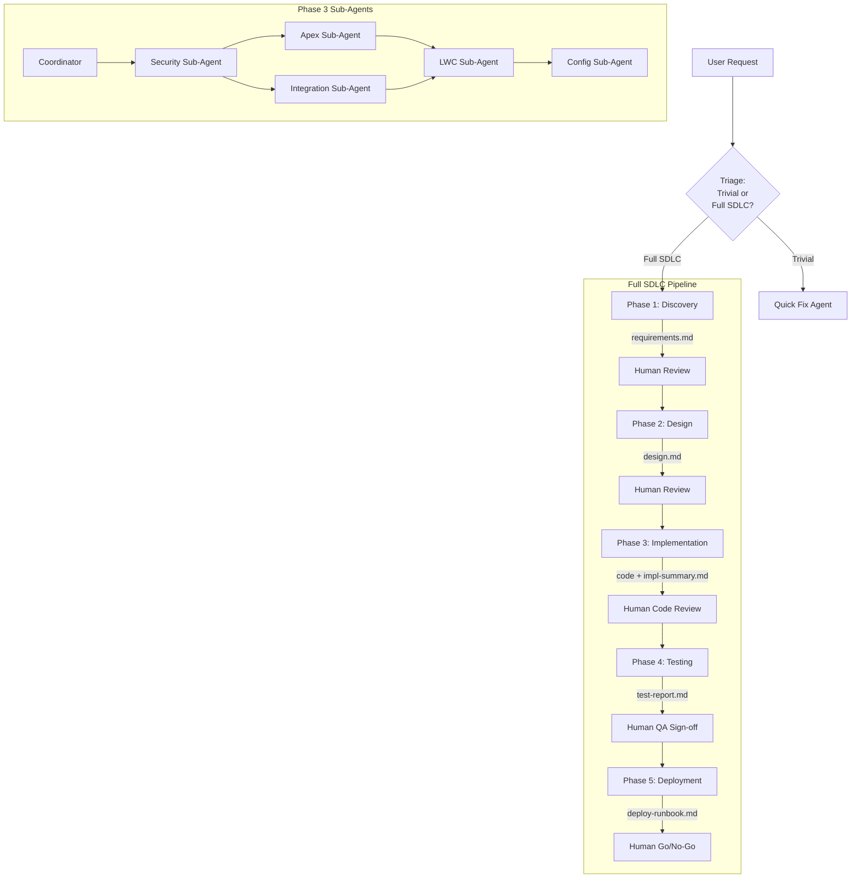
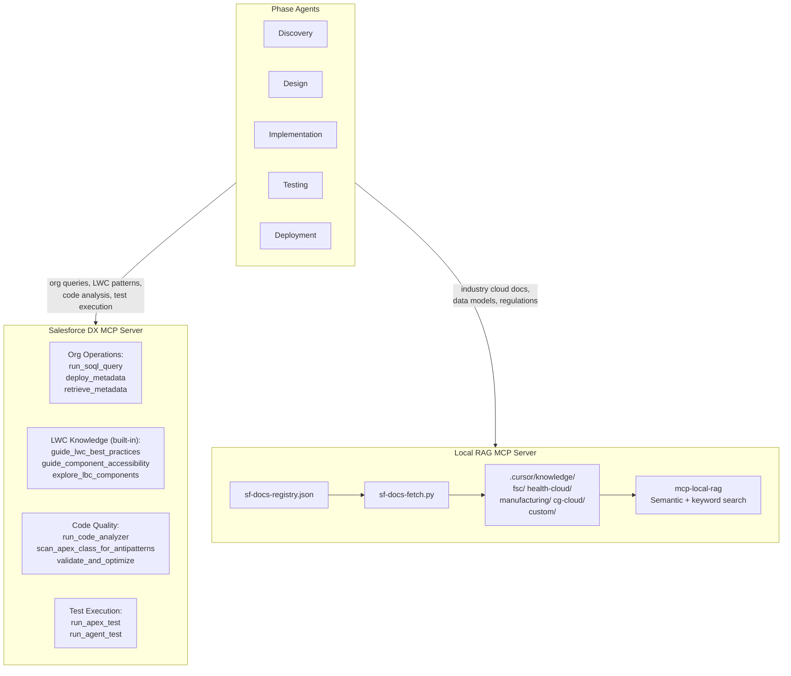
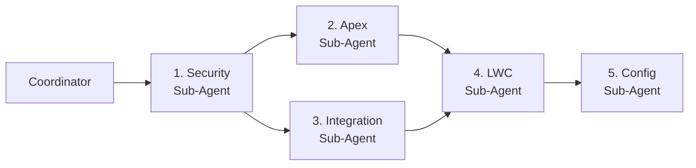
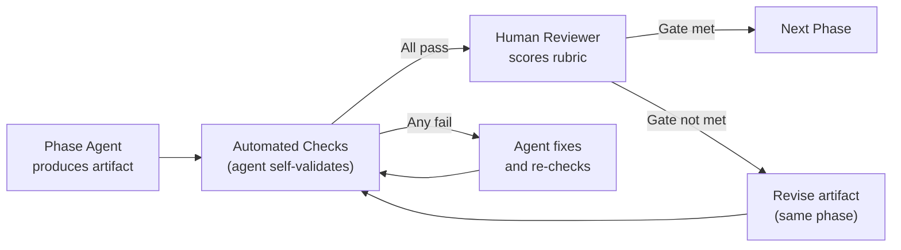

# ADLC for Salesforce

**Agent Development Life Cycle -- A Phase-Based Agent Architecture with Dynamic Knowledge Retrieval**

---

**Project**: LKInsurance
**Date**: April 2026
**Version**: 1.0

---

## Table of Contents

1. [Executive Summary](#1-executive-summary)
2. [Design Principles](#2-design-principles)
3. [System Architecture](#3-system-architecture)
4. [Phase Agents](#4-phase-agents)
5. [Knowledge Layer](#5-knowledge-layer)
6. [Artifact Handoff System](#6-artifact-handoff-system)
7. [Directory Structure](#7-directory-structure)
8. [Cursor Hooks Configuration](#8-cursor-hooks-configuration)
9. [MCP Configuration](#9-mcp-configuration)
10. [Extending to New Salesforce Clouds](#10-extending-to-new-salesforce-clouds)
11. [Context Budget Analysis](#11-context-budget-analysis)
12. [Phase Evaluation Framework](#12-phase-evaluation-framework)
13. [Implementation Roadmap](#13-implementation-roadmap)
14. [Retrofitting Existing Projects](#14-retrofitting-existing-projects)

---

## 1. Executive Summary

This proposal defines an AI-assisted development system for Salesforce projects built on two core ideas:

**One agent per SDLC phase.** Instead of loading every possible skill and rule into a single conversation, each phase of development -- Discovery, Design, Implementation, Testing, Deployment -- is handled by a dedicated AI agent with a focused context window. A human reviews and approves the output of each phase before the next begins. A lightweight Quick Fix agent handles trivial tasks that do not warrant the full pipeline.

**Dynamic knowledge retrieval.** Instead of manually curating knowledge bases per Salesforce cloud, the system uses two MCP servers -- the official Salesforce DX MCP Server for live org data and LWC knowledge, and a local RAG server backed by automatically downloaded Salesforce documentation for industry cloud knowledge. Adding support for a new Salesforce cloud takes minutes, not hours.

The system further optimizes by **assigning model tiers per task** -- frontier models (Opus, o3) for architecture and design reasoning, balanced models (Sonnet, GPT-4.1) for code generation, and fast models (Haiku, Gemini Flash) for test boilerplate and declarative configuration. A **structured evaluation framework** with automated checks and scored rubrics governs every phase gate, ensuring quality is measured consistently rather than left to ad-hoc review.

The architecture leverages **six Claude-specific API features** to maximize platform value: **Extended Thinking** provides auditable reasoning traces for frontier-tier architecture decisions; **Prompt Caching** reduces rule-content token costs by ~60-70% across the pipeline; **Message Batches** enables parallel test generation at 50% cost reduction; **Citations** make every RAG-sourced claim traceable to its source document; **Structured Outputs** produce machine-readable evaluation artifacts and FLS matrices for programmatic gate enforcement; and **Cursor Hooks** automate phase transitions, prerequisite validation, and metrics logging.

Together, these produce a system that is phase-disciplined, context-efficient, human-governed, cloud-extensible, cost-optimized, and production-focused.

---

## 2. Design Principles

**Focused context over universal context.** Each agent loads only the rules and knowledge relevant to its phase. This keeps the context window lean (30-80KB per agent) and reduces noise, contradictions, and hallucination risk.

**Structural human-in-the-loop.** Human review is not a rule the AI must remember to follow -- it is a physical gate between phases. The Implementation agent cannot run until a human has approved the Design artifact. This is more reliable than prompt-based enforcement.

**Artifacts as contracts.** Phases communicate through structured markdown artifacts, not conversation history. Each artifact is self-contained: the Design agent can understand the feature entirely from `requirements.md` without access to the Discovery conversation.

**Two knowledge sources, clear boundaries.** The Salesforce DX MCP Server handles live org operations and built-in LWC/SLDS knowledge. A local RAG MCP server handles industry cloud documentation (FSC, Health Cloud, Manufacturing, CG Cloud). There is no overlap and no ambiguity about which server to query for what.

**Cloud-extensible by configuration.** Adding a new Salesforce cloud requires editing one JSON file and running one CLI command. No code changes, no account dependencies, no manual uploads.

**Right model for the right task.** Frontier models handle tasks that require deep reasoning (design, architecture). Fast models handle well-constrained, pattern-heavy tasks (test generation, config). This reduces cost by 5-10x on high-volume phases without sacrificing quality on critical ones.

**Measured quality at every gate.** Each phase gate has automated checks (run by the agent) and a scored rubric (completed by the human reviewer). The evaluation record is appended to the artifact, creating an audit trail and a feedback loop for refining model assignments.

**Security as a first-class sub-agent.** Security is not a checklist applied after implementation -- it is the first sub-agent dispatched in the Implementation phase. Permission sets, FLS, sharing rules, and encryption are defined before any code is written, so all subsequent sub-agents build on a security foundation.

**Machine-readable quality gates.** Evaluation artifacts and security matrices are produced as structured JSON using Claude's structured outputs, then rendered as markdown for human readability. This enables automated gate enforcement (hooks verify JSON before allowing next-phase invocation), programmatic FLS validation (diff JSON against actual metadata), and trend analysis across projects.

---

## 3. System Architecture

### 3.1 Overall Flow



### 3.2 Knowledge Architecture



### 3.3 Knowledge Resolution

When a phase agent needs information, it follows this resolution order:

| Priority | Source | What It Provides |
|----------|--------|-----------------|
| 1a | Salesforce DX MCP | Live org data, metadata, LWC/SLDS knowledge, code analysis, test execution |
| 1b | Local RAG MCP | Industry cloud documentation, data models, business processes, regulations |
| 2 | Foundation rules | Salesforce platform fundamentals (naming, security, governor limits) |
| 3 | Phase-specific rules | Phase methodology and patterns (built into each agent's rule set) |

Tiers 1a and 1b are queried based on the type of question (org-specific vs. cloud-knowledge), not as a sequential fallback.

### 3.4 Model Selection Strategy

Not every phase requires the same model. High-reasoning tasks (architecture, cross-cutting design decisions) need frontier models. High-volume, well-constrained tasks (test boilerplate, documentation, label changes) can use faster and cheaper models without sacrificing quality. Each phase agent specifies its model in its `SKILL.md`, and Cursor's Task tool `model` parameter routes accordingly.

#### Model Tiers

| Tier | Models | Characteristics | Cost/Latency Profile |
|------|--------|----------------|---------------------|
| **Frontier** | Claude Opus, o3 | Deep reasoning, multi-step planning, nuanced trade-offs | Highest cost, highest latency |
| **Balanced** | Claude Sonnet, GPT-4.1 | Strong code generation, good reasoning, reliable instruction following | ~3-5x cheaper than frontier |
| **Fast** | Claude Haiku, GPT-4.1-mini, Gemini Flash | Pattern-following, template population, well-constrained tasks | ~10-20x cheaper than frontier, ~3x faster |

#### Phase-to-Model Assignment

| Phase / Sub-Agent | Recommended Tier | Rationale |
|-------------------|-----------------|-----------|
| **Discovery** | Frontier | Requires nuanced understanding of business requirements, ability to ask insightful clarifying questions, and judgment about feasibility |
| **Design** | Frontier | Architecture decisions, Well-Architected assessment, Configuration-First evaluation, and security model design require deep multi-step reasoning |
| **Implementation Coordinator** | Frontier | Cross-sub-agent orchestration, dependency ordering, and integration validation require planning capability |
| **Impl: Apex Sub-Agent** | Balanced | Code generation with well-defined patterns (trigger framework, service layer, CRUD/FLS). Patterns are constrained by rules; reasoning is bounded |
| **Impl: LWC Sub-Agent** | Balanced | Component generation with SLDS/accessibility patterns. DX MCP provides built-in guidance, reducing reasoning burden |
| **Impl: Integration Sub-Agent** | Balanced | Callout patterns, Named Credentials, error handling. Follows established integration patterns from rules |
| **Impl: Security Sub-Agent** | Balanced | Permission set generation, FLS matrix, sharing rules. Structured output from well-defined security requirements |
| **Impl: Config Sub-Agent** | Fast | Declarative configuration is highly constrained (Flows, Validation Rules, Formula Fields). Output follows strict metadata patterns |
| **Testing** | Fast | Test class generation is pattern-heavy: test data factory, bulk insert, assert. Strategy portion uses balanced tier (see below) |
| **Deployment** | Fast | Runbook generation, package.xml assembly, and deployment commands are templated and well-constrained |
| **Quick Fix** | Fast | Trivial changes with narrow scope. If the task requires reasoning, the guardrail redirects to Discovery |

#### Split-Model Phases

Some phases benefit from using two tiers within a single agent session:

**Testing Agent**: Use the balanced tier for test strategy (identifying edge cases, security scenarios, bulk patterns) and the fast tier for generating the actual test class boilerplate. In practice, the Testing SKILL.md specifies the balanced tier, and delegates bulk test generation to a sub-task that uses the fast tier.

**Deployment Agent**: Use the balanced tier if the deployment involves data migration scripts or complex environment-specific logic. Default to fast tier for standard source-deploy runbooks.

#### Escalation Pattern

If a fast-tier model produces output that fails the phase evaluation gate (Section 12), the phase is re-run with the next tier up:

```
Fast (fails gate) --> Balanced (re-run) --> Frontier (re-run, last resort)
```

The evaluation artifact records which tier produced the passing output, providing data to refine tier assignments over time.

#### Extended Thinking

Frontier-tier agents use Claude's **extended thinking** capability, which provides a dedicated reasoning scratchpad where the model works through multi-step trade-offs before producing the final artifact. This is configured via the `thinking` parameter in the API request and produces `thinking` content blocks alongside the final `text` response.

| Tier | Thinking Config | Budget | Rationale |
|------|----------------|--------|-----------|
| **Frontier** | `thinking: {type: "enabled", budget_tokens: 20000}` | 15,000-25,000 tokens | Architecture decisions, requirement synthesis, and dispatch planning require multi-step reasoning. Thinking blocks provide an auditable reasoning trace. |
| **Balanced** | Disabled | -- | Code generation follows well-constrained patterns from rules. Thinking overhead adds latency without quality gains. |
| **Fast** | Disabled | -- | Template-based tasks. Thinking would increase cost without benefit. |

**Phase-specific budgets:**

| Phase | Thinking Budget | What Gets Reasoned Through |
|-------|----------------|---------------------------|
| Discovery | 10,000-15,000 tokens | Synthesizing org query results with cloud business processes; feasibility assessment; requirement completeness analysis |
| Design | 15,000-25,000 tokens | Configuration-First vs code evaluation; Well-Architected pillar trade-offs; sharing model implications; governor limit analysis; security model design |
| Impl Coordinator | 5,000-10,000 tokens | Sub-agent dispatch ordering; dependency analysis; cross-cutting integration concerns |

**Reasoning trace artifacts:** Frontier-tier agents save the thinking blocks as a companion artifact alongside the main output. The Discovery agent saves `requirements-reasoning.md`, the Design agent saves `design-reasoning.md`. These are not handoff artifacts -- they are not read by downstream agents -- but they serve as an audit trail for the human reviewer to validate reasoning quality, not just output quality.

#### SKILL.md Model Field

Each agent's SKILL.md includes a `model` directive with optional thinking configuration:

```markdown
---
model: opus
fallback_model: sonnet
thinking:
  enabled: true
  budget_tokens: 20000
---
```

The Cursor Task tool reads this when spawning the agent. The `fallback_model` is used on escalation. Balanced-tier and fast-tier SKILL.md files omit the `thinking` block (disabled by default).

---

## 4. Phase Agents

### 4.1 Phase 1: Discovery Agent

**Purpose**: Understand the requirement, query the org, produce a structured requirements document.

**Rules loaded**:
- `foundation/` (naming, security, governor limits -- light reference)
- `phase-1-discovery.md` (business analysis patterns, requirement gathering)
- Active project context

**Input**: User requirement (natural language, Jira ticket, or markdown file)

**Process**:
1. Ask clarifying questions (functional, non-functional, constraints)
2. Query org via Salesforce DX MCP (`run_soql_query`) to discover existing objects, fields, and automation
3. Query Local RAG MCP for cloud-specific business process documentation
4. Identify impacted objects and existing automation
5. Assess: is this trivially solvable with configuration? (early exit to Quick Fix)

**Extended thinking**: Enabled with 10,000-15,000 token budget. Claude reasons through requirement completeness, feasibility trade-offs, and org query synthesis before producing the final artifact.

**Output**: `artifacts/{feature-name}/requirements.md`
- Feature name, description, priority
- Functional requirements (numbered)
- Non-functional requirements (performance, security, accessibility)
- Impacted objects and fields (from org query)
- Existing automation/config found (from org query)
- Constraints and assumptions
- Acceptance criteria
- Open questions

**Reasoning trace**: `artifacts/{feature-name}/requirements-reasoning.md` -- saved thinking blocks for reviewer audit. Not read by downstream agents.

**Human checkpoint**: Review requirements and optionally inspect reasoning trace. Approve or revise.

---

### 4.2 Phase 2: Design Agent

**Purpose**: Produce a solution design based on approved requirements.

**Rules loaded**:
- `foundation/` (shared subset)
- `phase-2-design.md` (Well-Architected Framework, Configuration-First principle, architecture patterns, data model patterns, integration patterns)
- Active project context

**Input**: `artifacts/{feature-name}/requirements.md`

**Process**:
1. Evaluate Configuration-First (Flow vs Apex vs Validation Rule vs Formula)
2. If declarative: document the configuration approach
3. If code needed: design data model, component architecture, integration points
4. Query Local RAG for industry cloud data model documentation and regulations
5. Query Salesforce DX MCP for LWC best practices (`guide_lwc_best_practices`, `guide_component_accessibility`)
6. Assess against Well-Architected pillars (TRUSTED, EASY, ADAPTABLE)
7. Identify which sub-agents are needed in Implementation (Apex, LWC, Config)

**Extended thinking**: Enabled with 15,000-25,000 token budget. Claude reasons through Configuration-First vs code trade-offs, Well-Architected pillar scoring, sharing model implications, and governor limit analysis before committing to an architecture.

**Output**: `artifacts/{feature-name}/design.md`
- Approach decision (declarative vs code, with rationale)
- Data model changes (new objects/fields, ERD)
- Component architecture (Apex classes, LWC components, Flows)
- Integration points (if any)
- Security considerations
- Well-Architected assessment
- Implementation sub-agents needed (Apex, LWC, Config)
- Risk assessment

**Reasoning trace**: `artifacts/{feature-name}/design-reasoning.md` -- saved thinking blocks showing how the architecture was derived. Particularly valuable for Well-Architected pillar trade-offs.

**Human checkpoint**: Review design and reasoning trace. Approve architecture.

---

### 4.3 Phase 3: Implementation Agent (Coordinator + Sub-Agents)

**Purpose**: Build the solution per approved design.

#### Coordinator

- Reads `requirements.md` + `design.md`
- Determines which sub-agents to invoke based on the design
- Dispatches work in a dependency-aware order (see below)
- Validates integration between sub-agent outputs
- Runs cross-sub-agent checks (e.g., Apex service called by LWC exists, permission sets cover all new objects/fields)

**Dispatch order**:



1. **Security Sub-Agent first** -- defines the permission model (permission sets, FLS, sharing rules, OWD). All subsequent sub-agents build against this security foundation.
2. **Apex Sub-Agent** -- generates classes/triggers with CRUD/FLS enforcement baked in from the start, referencing the security model.
3. **Integration Sub-Agent** (parallel with Apex if no dependency) -- builds callout classes using Named Credentials defined in the security model.
4. **LWC Sub-Agent** -- builds components that call Apex methods and respect FLS-driven field visibility.
5. **Config Sub-Agent last** -- builds Flows and Validation Rules that operate within the permission and sharing model.

#### Security Sub-Agent

**Purpose**: Implement and validate all metadata-level security -- object permissions, field-level security, sharing rules, permission sets, and encryption.

**Model tier**: Balanced

**Rules**: `foundation/` + `phase-3-implementation.md` + security-specific patterns:
- Object-level security (CRUD permissions per profile/permission set)
- Field-level security (FLS: visible, read-only, hidden per profile/permission set)
- Record-level security (OWD settings, sharing rules, manual sharing, Apex managed sharing)
- Permission Set design (granular, assignable, permission set groups for role-based bundles)
- Sharing model design (private OWD + criteria-based sharing rules vs public read/write trade-offs)
- Apex security enforcement (`WITH USER_MODE`, `WITH SECURITY_ENFORCED`, `stripInaccessible()`, `Security.stripInaccessible()`)
- CSP Trusted Sites for LWC external calls
- Shield Platform Encryption (field-level encryption for PII/PHI, deterministic vs probabilistic)
- Session settings and login IP ranges (when applicable)

**MCP usage**:
- Salesforce DX: `retrieve_metadata` (current profiles, permission sets, sharing rules, OWD), `run_soql_query` (check Organization.DefaultAccountAccess, existing sharing rules)
- Salesforce DX: `assign_permission_set` (for test validation in scratch orgs)
- Local RAG: `query_documents` (industry-specific compliance requirements -- HIPAA for Health Cloud, FINRA/SEC for FSC, PCI for payment data)

**Produces**:
- Permission Set metadata (`.permissionset-meta.xml`) with object CRUD and field-level visibility
- Permission Set Group definitions (`.permissionsetgroup-meta.xml`) for role-based assignment
- Sharing Rule metadata (criteria-based and owner-based)
- OWD recommendations with rationale
- FLS matrix: a table documenting every new/modified field, its visibility per permission set, and read/edit access

```
| Object.Field                  | PS: Agent_User | PS: Manager | PS: Admin | PS: API_Integration |
|-------------------------------|----------------|-------------|-----------|---------------------|
| Policy__c.Premium__c          | Read           | Read/Edit   | Read/Edit | Read                |
| Policy__c.SSN__c (encrypted)  | Hidden         | Read        | Read/Edit | Hidden              |
| Claim__c.Status__c            | Read           | Read/Edit   | Read/Edit | Read/Edit           |
```

- Security review checklist (CRUD/FLS enforcement method per class, Named Credentials usage, no hardcoded secrets, encryption coverage)

#### Apex Sub-Agent

**Model tier**: Balanced

**Rules**: `foundation/` + `phase-3-implementation.md` + Apex-specific patterns (trigger framework, bulkification, service layer, CRUD/FLS enforcement)

**MCP usage**:
- Salesforce DX: `run_code_analyzer`, `scan_apex_class_for_antipatterns` (validate code quality)
- Local RAG: `query_documents` (cloud-specific object relationships and API patterns)

**Security integration**: References the Security Sub-Agent's permission set definitions to ensure:
- All data access uses `WITH USER_MODE` or `stripInaccessible()`
- Service methods document their required permission set
- No direct DML without CRUD check

**Produces**: Apex classes and triggers with proper naming, security enforcement, and bulkification.

#### Integration Sub-Agent

**Purpose**: Handle all external system integrations -- REST/SOAP callouts, platform events, Change Data Capture, middleware coordination.

**Model tier**: Balanced

**Rules**: `foundation/` + `phase-3-implementation.md` + integration-specific patterns:
- Named Credentials (never hardcode endpoints, tokens, or credentials; use Named Credential + External Credential)
- Callout patterns (`HttpRequest`/`HttpResponse`, typed request/response wrappers, continuation pattern for long-running callouts in LWC)
- Error handling (retry with exponential backoff, circuit breaker pattern, dead letter queue via Platform Event or Custom Object)
- Platform Events (publish/subscribe, replay ID management, event bus best practices, high-volume events)
- Change Data Capture (CDC subscription for sync with external systems, `ChangeEventHeader` parsing)
- External Services (OpenAPI 3.0 spec registration, auto-generated Apex actions)
- Middleware decision framework (direct callout for simple 1:1 sync; MuleSoft/middleware for orchestration, transformation, or fan-out)
- Async callout patterns (Queueable with `Database.AllowsCallouts`, chaining for multi-step, governor limit: 100 callouts per transaction)
- Idempotency (correlation IDs, duplicate detection, upsert keys for inbound integrations)

**MCP usage**:
- Salesforce DX: `retrieve_metadata` (check Named Credentials, External Services, Remote Site Settings, CSP Trusted Sites)
- Local RAG: `query_documents` (integration architecture patterns, middleware documentation)

**Security integration**: Uses Named Credentials from the Security Sub-Agent's output. References CSP Trusted Sites for any LWC-to-external callouts.

**Produces**:
- Apex callout classes with Named Credentials (no hardcoded URLs)
- Typed request/response wrapper classes
- Platform Event definitions (`.object-meta.xml`) and subscriber triggers
- CDC subscriber configuration
- External Service registrations (OpenAPI spec files)
- Error handling: retry utility class, circuit breaker implementation, dead letter logging
- `HttpCalloutMock` implementations for every external endpoint (used by Testing agent)
- Integration architecture diagram (which system calls which, auth method, sync vs async, error path)

#### LWC Sub-Agent

**Model tier**: Balanced

**Rules**: `foundation/` + `phase-3-implementation.md` + LWC-specific patterns (component structure, @wire, events, SLDS, accessibility)

**MCP usage**:
- Salesforce DX: `guide_lwc_development`, `explore_lbc_components`, `guide_component_accessibility`, `guide_lws_security`, `explore_slds_blueprints`
- Local RAG: `query_documents` (cloud-specific UI patterns if applicable)

**Security integration**: Respects FLS matrix -- components display only fields visible to the running user's permission set. Uses `@wire` adapters that enforce FLS server-side. For external calls from LWC, uses CSP Trusted Sites registered by Security Sub-Agent.

**Produces**: LWC components with proper structure, SLDS styling, accessibility compliance, and FLS-aware field rendering.

#### Config Sub-Agent

**Model tier**: Fast

**Rules**: `foundation/` + `phase-3-implementation.md` + declarative patterns (Flows, Validation Rules, Formula Fields, Approval Processes)

**MCP usage**:
- Salesforce DX: `retrieve_metadata` (check existing flows and configuration)
- Local RAG: `query_documents` (cloud-specific automation patterns)

**Security integration**: Flows run in user context by default. Config Sub-Agent documents which permission sets are required for each Flow to execute successfully. Validation Rules reference only fields accessible per the FLS matrix.

**Produces**: Flow definitions, validation rule specs, configuration instructions, with permission requirements documented.

#### Implementation Output

**Output**: `artifacts/{feature-name}/impl-summary.md`
- Files created/modified (with paths)
- Apex classes and their responsibilities
- LWC components and their responsibilities
- Flows/config changes
- **Integration points** (endpoint, authentication method, sync/async, error handling strategy, retry policy)
- **Security model** (permission sets created, FLS matrix, sharing rules, OWD settings)
- **Security validation results** (CRUD/FLS enforcement method per class, Named Credentials usage, no hardcoded secrets, encryption fields identified)
- Known limitations
- Dependencies between components

**Human checkpoint**: Code review (includes security review of permission sets and integration patterns).

---

### 4.4 Phase 4: Testing Agent

**Purpose**: Produce test classes, test plans, and validate coverage.

**Rules loaded**:
- `foundation/` (shared)
- `phase-4-testing.md` (testing standards, 75%+ coverage, bulk testing, mock callouts, Jest patterns, test data factories)
- Active project context

**Input**: All prior artifacts + actual code from Phase 3

**Process** (two-phase: strategy then batch generation):

**Phase A -- Test Strategy (balanced tier):**
1. Analyze all Apex classes, LWC components, and integration endpoints from `impl-summary.md`
2. Create test plan (positive, negative, bulk, edge cases, security, integration)
3. For each class/component, define: test class name, scenarios, assertion strategy, mock requirements
4. Produce a test manifest listing all test classes to generate

**Phase B -- Batch Generation (fast tier, via Message Batches API):**
5. Submit all test class generation requests as a single Claude Message Batch
6. Each batch request includes: the source class + test data factory pattern + testing rules as context
7. Batch completes asynchronously (typically <1 hour); 50% cost reduction vs sequential calls

```
Batch request example:
{
  requests: [
    {id: "test-PolicyService", system: [rules], user: "Generate test for PolicyService.cls ..."},
    {id: "test-ClaimHandler",  system: [rules], user: "Generate test for ClaimHandler.cls ..."},
    {id: "test-PaymentCallout",system: [rules], user: "Generate HttpCalloutMock for PaymentAPI ..."},
    {id: "jest-policyCard",    system: [rules], user: "Generate Jest test for policyCard LWC ..."},
  ]
}
```

**Phase C -- Validation:**
8. Execute all tests via Salesforce DX MCP (`run_apex_test`)
9. Validate production readiness (`validate_and_optimize`, `score_issues`)
10. If any test fails or coverage is below 75%, regenerate the failing test (individual request, not batch)

**Batch generation applicability:**
- Apex test classes (one per source class)
- Jest test files (one per LWC component)
- HttpCalloutMock implementations (one per external endpoint)
- Test data factory methods (one per custom object with complex setup)

**Cost impact:** For a feature with 5 Apex classes, 3 LWC components, and 2 integration endpoints, batch generation produces 10 test artifacts in parallel at 50% cost reduction vs sequential fast-tier calls. Combined with the fast-tier pricing (~10-20x cheaper than frontier), total test generation cost is approximately 5-10% of what equivalent frontier-tier sequential calls would cost.

**Output**: `artifacts/{feature-name}/test-report.md`
- Test classes created (with paths)
- Test plan (scenarios, expected results)
- Coverage targets per class
- Edge cases tested
- Bulk test scenarios
- Security test scenarios
- Integration test scenarios (mock callouts, error responses)
- Production readiness score
- Batch generation metadata (batch ID, completion time, per-request status)

**Human checkpoint**: QA sign-off.

---

### 4.5 Phase 5: Deployment Agent

**Purpose**: Prepare deployment package and runbook.

**Rules loaded**:
- `foundation/` (shared)
- `phase-5-deployment.md` (CI/CD, package.xml, change sets, scratch orgs, validation, rollback)
- Active project context

**Input**: All prior artifacts

**MCP usage**:
- Salesforce DX: `deploy_metadata`, `list_all_orgs`

**Output**: `artifacts/{feature-name}/deploy-runbook.md`
- Deployment method (source deploy, change set, package)
- Pre-deployment steps
- Deployment commands
- Post-deployment validation
- Rollback plan
- Smoke test checklist

**Human checkpoint**: Go/no-go decision.

---

### 4.6 Quick Fix Agent

**Purpose**: Handle trivial tasks that do not warrant the full 5-phase pipeline.

**Rules loaded**: `foundation/` + `quick-fix.md` (light rules covering naming, security, basic testing)

**Scope**:
- Typo fixes, simple renames
- Single field additions
- Simple validation rule changes
- Label/translation updates
- Bug fixes with obvious root cause

**MCP usage**: Salesforce DX only (`run_soql_query`, `deploy_metadata`)

**Guardrail**: If the Quick Fix agent determines the task is non-trivial (touches multiple objects, requires architecture decisions, has security implications), it redirects to Phase 1: Discovery.

---

## 5. Knowledge Layer

### 5.1 Salesforce DX MCP Server (Official)

The official [Salesforce DX MCP Server](https://github.com/salesforcecli/mcp) (`@salesforce/mcp`), released as part of [Salesforce Headless 360](https://www.salesforce.com/news/stories/salesforce-headless-360-announcement/) (April 2026), provides 60+ tools organized into toolsets.

| Toolset | Key Tools | Used By Phase |
|---------|-----------|---------------|
| `orgs` | `list_all_orgs`, `create_scratch_org` | Discovery, Deployment |
| `metadata` | `deploy_metadata`, `retrieve_metadata` | Implementation, Deployment |
| `data` | `run_soql_query` | Discovery, Implementation |
| `users` | `assign_permission_set` | Deployment |
| `lwc-experts` | `guide_lwc_best_practices`, `guide_component_accessibility`, `explore_lbc_components`, `guide_lws_security`, `create_lwc_jest_tests`, `explore_slds_blueprints` | Design, Implementation (LWC) |
| `code-analysis` | `run_code_analyzer`, `scan_apex_class_for_antipatterns` | Implementation (Apex), Testing |
| `testing` | `run_apex_test`, `run_agent_test` | Testing |
| `experts-validation` | `validate_and_optimize`, `score_issues` | Testing |
| `scale-products` | `scan_apex_class_for_antipatterns` | Implementation (Apex) |
| `devops` | `commit_devops_center_work_item`, `promote_devops_center_work_item` | Deployment |

The `lwc-experts` toolset is particularly noteworthy -- tools like `guide_lwc_best_practices` and `explore_lbc_components` have Salesforce's own documentation embedded as markdown knowledge files, eliminating the need to separately index LWC documentation.

**Prerequisite**: Salesforce CLI installed with at least one authorized org (`sf org login web`).

### 5.2 Local RAG MCP Server (Industry Cloud Documentation)

The Salesforce DX MCP does not cover industry cloud-specific knowledge:
- Data models (FSC `FinServ__FinancialAccount__c`, Health Cloud `HealthCloudGA__CarePlan__c`, CG Cloud `RetailStore`)
- Business processes (loan origination, patient care coordination, retail execution)
- Industry regulations (FINRA/SEC, HIPAA, PCI)
- Well-Architected patterns beyond LWC scope
- Team-specific learnings and project patterns

This gap is filled by a local RAG MCP server backed by automatically downloaded Salesforce documentation.

**Technology**: [mcp-local-rag](https://github.com/shinpr/mcp-local-rag) (v0.12.0, April 2026)
- Runs entirely locally (no API keys, no cloud dependency)
- Supports PDF, Markdown, TXT, DOCX
- Semantic search with keyword boosting (critical for Apex class names, object API names)
- Smart semantic chunking (keeps related content together)
- Zero-friction setup via `npx`
- MCP tools: `ingest_file`, `query_documents`, `list_files`, `delete_file`, `status`

**Citations integration:** When a phase agent receives RAG query results, the results are passed to Claude as `document` content blocks with `citations: {enabled: true}`. Claude's response includes character-level or chunk-level citations back to the source documents. This enables verifiable source attribution -- every claim about a cloud data model, business process, or regulation is traceable to a specific document and passage.

```json
{
  "citations": {"enabled": true},
  "messages": [{
    "role": "user",
    "content": [
      {"type": "document", "source": {"type": "text", "media_type": "text/plain",
        "data": "<RAG result from FSC Admin Guide>"}, "title": "FSC Admin Guide"},
      {"type": "text", "text": "Design the data model for policy management."}
    ]
  }]
}
```

Citations are used by:
- **Discovery Agent**: Citing cloud business processes and existing data models
- **Design Agent**: Referencing industry data models, regulatory requirements, and architecture patterns
- **Security Sub-Agent**: Citing compliance requirements (HIPAA, FINRA/SEC, PCI)
- **Integration Sub-Agent**: Referencing middleware patterns and API documentation

### 5.3 Salesforce Documentation Registry

A JSON registry file maps each Salesforce cloud to its official documentation sources. Salesforce publishes Help docs as PDFs at a predictable URL pattern:

```
https://resources.docs.salesforce.com/latest/latest/en-us/sfdc/pdf/{doc_slug}.pdf
```

Registry structure (`sf-docs-registry.json`):

```json
{
  "clouds": {
    "fsc": {
      "name": "Financial Services Cloud",
      "docs": [
        {"slug": "salesforce_finserv_admin_guide", "title": "FSC Admin Guide"},
        {"slug": "financial_services", "title": "FSC User Guide"},
        {"slug": "salesforce_finserv_install_guide", "title": "FSC Install Guide"}
      ],
      "trailhead_modules": [
        "financial-services-cloud-basics",
        "wealth-management-best-practices"
      ]
    },
    "health-cloud": {
      "name": "Health Cloud",
      "docs": [
        {"slug": "salesforce_health_cloud_impl_guide", "title": "Health Cloud Implementation Guide"},
        {"slug": "health_cloud_admin", "title": "Health Cloud Admin Guide"}
      ]
    },
    "manufacturing": {
      "name": "Manufacturing Cloud",
      "docs": [
        {"slug": "manufacturing_admin", "title": "Manufacturing Cloud Admin Guide"}
      ]
    },
    "cg-cloud": {
      "name": "Consumer Goods Cloud",
      "docs": [
        {"slug": "consumer_goods_cloud_admin", "title": "CG Cloud Admin Guide"}
      ]
    },
    "platform": {
      "name": "Salesforce Platform (shared)",
      "docs": [
        {"slug": "apexcode", "title": "Apex Developer Guide"},
        {"slug": "api_rest", "title": "REST API Developer Guide"},
        {"slug": "soql_sosl", "title": "SOQL and SOSL Reference"}
      ]
    }
  }
}
```

### 5.4 Documentation Fetcher CLI

A Python script reads the registry and downloads documentation for specified clouds.

```bash
python .cursor/tools/sf-docs-fetch.py --cloud fsc            # One cloud
python .cursor/tools/sf-docs-fetch.py --cloud fsc --cloud health-cloud  # Multiple
python .cursor/tools/sf-docs-fetch.py --all                   # All registered
python .cursor/tools/sf-docs-fetch.py --cloud fsc --update    # Re-download newer
python .cursor/tools/sf-docs-fetch.py --list                  # List available
```

The fetcher:
1. Reads `sf-docs-registry.json`
2. Downloads PDFs from `resources.docs.salesforce.com`
3. Saves to `.cursor/knowledge/{cloud-name}/`
4. Writes `manifest.json` with download dates and checksums
5. Skips already-downloaded files unless `--update` is passed

**Dependencies**: Python standard library only (`urllib`, `json`, `hashlib`, `pathlib`).

### 5.5 Custom and Team-Specific Knowledge

For proprietary patterns, project learnings, or internal best practices, teams can drop `.md` files directly into `.cursor/knowledge/{cloud}/custom/`. The RAG server indexes these alongside official documentation.

```
.cursor/knowledge/fsc/
  salesforce_finserv_admin_guide.pdf     # Official (auto-downloaded)
  financial_services.pdf                  # Official (auto-downloaded)
  custom/
    our-fsc-patterns.md                   # Team-specific (manual)
    client-specific-requirements.md       # Project-specific (manual)
```

### 5.6 Foundation Rules

A compact set of always-active rules providing Salesforce platform fundamentals. These are loaded by every phase agent as baseline knowledge.

| Rule File | Content |
|-----------|---------|
| `foundation/naming-conventions.md` | PascalCase objects, camelCase methods, trigger naming, LWC naming, constant naming |
| `foundation/security-baseline.md` | CRUD/FLS enforcement, `WITH USER_MODE`, sharing rules, bind variables, Named Credentials |
| `foundation/governor-limits.md` | 100 SOQL queries (sync), 10K DML rows, bulkification requirements, async patterns |

### 5.7 Prompt Caching Strategy

Every agent loads foundation rules (~15-20KB) and phase-specific rules on every invocation. Within a single feature lifecycle, this same content is sent 7-10 times across Discovery, Design, and all five Implementation sub-agents. Claude's **prompt caching** eliminates this redundancy.

**How it works:** Content blocks marked with `cache_control: {"type": "ephemeral"}` are cached after the first request. Subsequent requests that include the same prefix pay only 10% of the input token cost (90% discount). The first write pays a 25% premium.

**Caching layout per feature lifecycle:**

```
Agent              | foundation/  | Phase rules          | Cache benefit
-------------------|-------------|----------------------|-------------------
Discovery          | WRITE       | WRITE (phase-1)      | --
Design             | READ        | WRITE (phase-2)      | foundation: 90% off
Impl Coordinator   | READ        | WRITE (phase-3)      | foundation: 90% off
Impl: Security     | READ        | READ  (phase-3)      | both: 90% off
Impl: Apex         | READ        | READ  (phase-3)      | both: 90% off
Impl: Integration  | READ        | READ  (phase-3)      | both: 90% off
Impl: LWC          | READ        | READ  (phase-3)      | both: 90% off
Impl: Config       | READ        | READ  (phase-3)      | both: 90% off
Testing            | READ        | WRITE (phase-4)      | foundation: 90% off
Deployment         | READ        | WRITE (phase-5)      | foundation: 90% off
```

**Estimated savings:** Foundation rules (~5K tokens) cached across 10 agents = 9 reads at 90% discount. Phase-3 rules cached across 5 sub-agents = 4 reads. Net input token cost reduction on rule content: ~60-70%.

**TTL constraint (critical):** As of March 2026, Claude's cache TTL is 5 minutes. Cache is highly effective within the Implementation phase (5 sub-agents dispatched in rapid succession) and within evaluation re-runs. Across phases separated by human review (hours or days), cache will expire and be re-written -- this is still beneficial because each phase's internal sub-tasks still benefit from caching.

**Implementation:** The system prompt for each agent is structured with foundation rules first (cached), phase rules second (cached), then dynamic content (artifacts, MCP results) last (not cached):

```
[System prompt block 1: foundation/ rules]       <-- cache_control: ephemeral
[System prompt block 2: phase-specific rules]     <-- cache_control: ephemeral
[System prompt block 3: project context]          <-- not cached (changes per project)
[User message: artifacts + task]                  <-- not cached (unique per invocation)
```

### 5.8 Project Context (Dynamic)

A generated rule file (`active-project-context.md`) provides project-specific knowledge to all phase agents. It is generated from a project documentation file and switches when the team changes projects.

```bash
python .cursor/tools/generate-project-context.py --input="PROJECT: MyProject.md"
python .cursor/tools/generate-project-context.py --deactivate   # Generic mode
```

Only this layer changes when switching between projects. All other layers (foundation, phase rules, knowledge) remain stable.

---

## 6. Artifact Handoff System

### 6.1 Principle

Artifacts are the contract between phases. Each phase agent produces a structured markdown file that the next phase agent reads as input. Artifacts are self-contained -- a phase agent should never need access to a prior phase's conversation history.

### 6.2 Artifact Flow

```
Discovery --> requirements.md --> [Human Review] --> Design
Design    --> design.md       --> [Human Review] --> Implementation
Implementation --> impl-summary.md + code --> [Human Code Review] --> Testing
Testing   --> test-report.md  --> [Human QA Sign-off] --> Deployment
Deployment --> deploy-runbook.md --> [Human Go/No-Go] --> Done
```

### 6.3 Artifact Templates

Each template defines mandatory sections that the phase agent fills in. Templates live in `.cursor/artifacts/templates/`.

**requirements.md** (Discovery output):
- Feature name, description, priority
- Functional requirements (numbered)
- Non-functional requirements
- Impacted objects and fields
- Existing automation found
- Constraints and assumptions
- Acceptance criteria
- Open questions
- **Sources** (citations from RAG queries: document title, passage reference, e.g., `[FSC-Admin-Guide:p47]`)

**design.md** (Design output):
- Approach decision (declarative vs code, with rationale)
- Data model changes (ERD)
- Component architecture
- Integration points
- Security considerations
- Well-Architected assessment (TRUSTED, EASY, ADAPTABLE)
- Implementation sub-agents needed
- Risk assessment
- **Sources** (citations from RAG and DX MCP queries, e.g., `[Health-Cloud-Impl:p112]`, `[HIPAA-Compliance:section-3]`)

**impl-summary.md** (Implementation output):
- Files created/modified (with paths)
- Apex class responsibilities
- LWC component responsibilities
- Flow/config changes
- Integration points (endpoint, auth method, sync/async, error handling, retry policy)
- Security model (permission sets, FLS matrix, sharing rules, OWD settings)
- Security validation results (CRUD/FLS method per class, Named Credentials, encryption)
- Known limitations
- Component dependencies

**test-report.md** (Testing output):
- Test classes created (with paths)
- Test plan (scenarios, expected results)
- Coverage per class
- Edge cases and bulk scenarios
- Security test scenarios
- Production readiness score

**deploy-runbook.md** (Deployment output):
- Deployment method
- Pre-deployment steps
- Deployment commands
- Post-deployment validation
- Rollback plan
- Smoke test checklist

### 6.4 Iteration Loops

When a later phase reveals a problem (e.g., Testing finds a design flaw), the artifact chain supports loops:

1. The Testing agent documents the issue in `test-report.md`
2. The human reviewer decides which phase to return to
3. The relevant artifact is updated (e.g., `design.md` is revised)
4. The pipeline resumes from that phase forward

---

## 7. Directory Structure

```
.cursor/
|-- rules/
|   |-- foundation/                     # Shared Salesforce platform rules
|   |   |-- naming-conventions.md
|   |   |-- security-baseline.md
|   |   +-- governor-limits.md
|   |-- phase-1-discovery.md            # Discovery-specific rules
|   |-- phase-2-design.md              # Design-specific rules (Well-Architected,
|   |                                   #   Configuration-First, architecture patterns)
|   |-- phase-3-implementation.md       # Implementation-specific rules
|   |-- phase-4-testing.md             # Testing-specific rules
|   |-- phase-5-deployment.md          # Deployment-specific rules
|   |-- quick-fix.md                   # Quick Fix agent rules
|   +-- active-project-context.md      # Dynamic project context (generated)
|
|-- skills/
|   |-- discovery/SKILL.md             # Phase 1 agent definition
|   |-- design/SKILL.md               # Phase 2 agent definition
|   |-- implementation/SKILL.md        # Phase 3 coordinator
|   |   |-- security/SKILL.md         # Security sub-agent (FLS, sharing, permissions)
|   |   |-- apex/SKILL.md             # Apex sub-agent
|   |   |-- integration/SKILL.md      # Integration sub-agent (callouts, events, CDC)
|   |   |-- lwc/SKILL.md              # LWC sub-agent
|   |   +-- config/SKILL.md           # Flow/declarative sub-agent
|   |-- testing/SKILL.md              # Phase 4 agent definition
|   |-- deployment/SKILL.md           # Phase 5 agent definition
|   |-- quick-fix/SKILL.md            # Quick Fix agent definition
|   |-- retrofit/SKILL.md             # Retrofit agent (existing project onboarding)
|   +-- _shared/
|       +-- knowledge-query-pattern.md # Two-MCP query strategy documentation
|
|-- artifacts/
|   |-- templates/
|   |   |-- requirements.md            # Discovery output template
|   |   |-- design.md                 # Design output template
|   |   |-- impl-summary.md           # Implementation output template
|   |   |-- test-report.md            # Testing output template
|   |   +-- deploy-runbook.md         # Deployment output template
|   +-- {feature-name}/               # Per-feature artifact directory
|       |-- requirements.md
|       |-- design.md
|       |-- impl-summary.md
|       |-- test-report.md
|       +-- deploy-runbook.md
|
|-- knowledge/
|   |-- sf-docs-registry.json          # Cloud-to-documentation mapping
|   |-- fsc/                           # Financial Services Cloud docs
|   |-- health-cloud/                  # Health Cloud docs
|   |-- manufacturing/                 # Manufacturing Cloud docs
|   |-- cg-cloud/                      # Consumer Goods Cloud docs
|   |-- platform/                      # Shared platform docs
|   +-- {cloud}/custom/                # Team-specific knowledge per cloud
|
|-- hooks.json                         # Cursor hooks configuration
|-- hooks/
|   |-- validate-phase-gate.sh         # Verify prerequisite artifacts + APPROVED gate
|   |-- log-agent-metrics.sh           # Log model tier, tokens, duration per invocation
|   +-- validate-artifact-schema.sh    # Validate artifact against JSON schema
|
+-- tools/
    |-- sf-docs-fetch.py               # Documentation fetcher CLI
    +-- generate-project-context.py    # Project context generator
```

---

## 8. Cursor Hooks Configuration

Cursor hooks automate and enforce the phase pipeline. They run as spawned processes at defined stages of the agent loop, communicating via JSON over stdio. Hooks are configured in `.cursor/hooks.json`.

### 8.1 Hook Events Used

| Hook Event | Purpose | When It Fires |
|-----------|---------|---------------|
| `sessionStart` | Verify prerequisite artifacts exist with APPROVED gate decision before allowing a phase agent to start | When any agent session begins |
| `afterFileEdit` | Auto-run artifact schema validation when an artifact is created or modified | After any file edit |
| `subagentStart` | Log sub-agent invocation with model tier for cost tracking; verify coordinator dispatch order | When a Task tool spawns a sub-agent |
| `stop` | Verify output artifact was created; validate against template schema; log completion metrics | When agent session completes |

### 8.2 hooks.json Configuration

```json
{
  "version": 1,
  "hooks": {
    "agent": [
      {
        "event": "sessionStart",
        "command": [".cursor/hooks/validate-phase-gate.sh"],
        "description": "Verify prerequisite artifacts and approved gate decisions"
      },
      {
        "event": "afterFileEdit",
        "command": [".cursor/hooks/validate-artifact-schema.sh"],
        "description": "Validate artifact against JSON schema on save",
        "filter": {
          "path": "**/.cursor/artifacts/**/*.json"
        }
      },
      {
        "event": "subagentStart",
        "command": [".cursor/hooks/log-agent-metrics.sh"],
        "description": "Log sub-agent invocation with model tier for cost tracking"
      },
      {
        "event": "stop",
        "command": [".cursor/hooks/validate-artifact-schema.sh"],
        "description": "Verify output artifact exists and passes schema validation"
      }
    ]
  }
}
```

### 8.3 Phase Gate Enforcement (validate-phase-gate.sh)

When a phase agent starts, this hook verifies the pipeline is in a valid state:

```
Phase agent     | Required prerequisite
----------------|---------------------------------------------------
Design          | artifacts/{feature}/requirements.md exists
                | artifacts/{feature}/evaluation.json has gate_decision=APPROVED
Implementation  | artifacts/{feature}/design.md exists
                | artifacts/{feature}/evaluation.json has gate_decision=APPROVED
Testing         | artifacts/{feature}/impl-summary.md exists
                | artifacts/{feature}/evaluation.json has gate_decision=APPROVED
Deployment      | artifacts/{feature}/test-report.md exists
                | artifacts/{feature}/evaluation.json has gate_decision=APPROVED
Quick Fix       | No prerequisites (standalone)
Discovery       | No prerequisites (pipeline entry point)
```

If prerequisites are missing or the gate decision is not APPROVED, the hook blocks the session and provides an error message indicating what needs to be completed.

### 8.4 Metrics Logging (log-agent-metrics.sh)

Every agent and sub-agent invocation is logged to `.cursor/artifacts/{feature-name}/metrics.jsonl` (one JSON line per invocation):

```json
{"timestamp": "2026-04-21T14:30:00Z", "agent": "design", "model_tier": "frontier", "thinking_budget": 20000, "input_tokens": 12500, "output_tokens": 8200, "thinking_tokens": 15400, "cache_status": "READ", "duration_ms": 45000, "gate_decision": "APPROVED"}
```

This data enables:
- **Cost analysis** per feature and per phase
- **Model tier optimization** (identify phases where fast tier consistently passes gates)
- **Cache hit rate** tracking (measure actual savings from prompt caching)
- **Throughput benchmarking** (time per phase, tokens per artifact)

---

## 9. MCP Configuration

The complete `.cursor/mcp.json`:

```json
{
  "mcpServers": {
    "Salesforce DX": {
      "command": "npx",
      "args": [
        "-y", "@salesforce/mcp",
        "--orgs", "DEFAULT_TARGET_ORG",
        "--toolsets", "orgs,metadata,data,users,lwc-experts,code-analysis,testing,experts-validation,scale-products,devops",
        "--allow-non-ga-tools"
      ]
    },
    "sf-knowledge": {
      "command": "npx",
      "args": ["-y", "mcp-local-rag"],
      "env": {
        "BASE_DIR": ".cursor/knowledge"
      }
    }
  }
}
```

### Per-Phase MCP Usage Matrix

| Phase Agent | Salesforce DX MCP | Local RAG MCP |
|-------------|-------------------|---------------|
| **Discovery** | `run_soql_query` (existing objects), `list_all_orgs` | `query_documents` (cloud business processes, data models) |
| **Design** | `guide_lwc_best_practices`, `guide_component_accessibility` | `query_documents` (architecture patterns, regulations, data model references) |
| **Impl (Security)** | `retrieve_metadata` (profiles, permission sets, sharing rules), `run_soql_query` (OWD settings), `assign_permission_set` | `query_documents` (compliance requirements -- HIPAA, FINRA, PCI) |
| **Impl (Apex)** | `run_code_analyzer`, `scan_apex_class_for_antipatterns` | `query_documents` (cloud-specific API patterns, object relationships) |
| **Impl (Integration)** | `retrieve_metadata` (Named Credentials, External Services, Remote Site Settings) | `query_documents` (integration patterns, middleware docs) |
| **Impl (LWC)** | `guide_lwc_development`, `explore_lbc_components`, `create_lwc_jest_tests`, `explore_slds_blueprints` | `query_documents` (cloud-specific UI patterns) |
| **Impl (Config)** | `retrieve_metadata` (check existing flows) | `query_documents` (cloud-specific automation patterns) |
| **Testing** | `run_apex_test`, `validate_and_optimize`, `score_issues` | Minimal |
| **Deployment** | `deploy_metadata`, DevOps Center tools | Minimal |
| **Quick Fix** | `run_soql_query`, `deploy_metadata` | None |

---

## 10. Extending to New Salesforce Clouds

Adding support for a new cloud (e.g., Education Cloud) requires three steps:

**Step 1: Update the registry** (~5 minutes)

Find the PDF slugs at `resources.docs.salesforce.com` and add entries to `sf-docs-registry.json`:

```json
"education": {
  "name": "Education Cloud",
  "docs": [
    {"slug": "education_cloud_admin", "title": "Education Cloud Admin Guide"},
    {"slug": "education_cloud_impl", "title": "Education Cloud Implementation Guide"}
  ]
}
```

**Step 2: Run the fetcher** (~1 minute)

```bash
python .cursor/tools/sf-docs-fetch.py --cloud education
```

**Step 3: Query** (immediate)

The RAG server auto-indexes the new documents. Phase agents can now query Education Cloud knowledge:

```
"What is the Education Cloud student data model?" -> query_documents (filter: education)
```

No code changes. No account dependencies. No manual uploads.

For team-specific patterns, drop `.md` files into `.cursor/knowledge/education/custom/`.

---

## 11. Context Budget Analysis

Each agent loads only what it needs, keeping context lean:

| Agent | Model Tier | Thinking | Cache Status | Est. Context | Effective Cost |
|-------|-----------|----------|-------------|--------------|---------------|
| Discovery | Frontier | 10-15K budget | WRITE foundation + phase-1 | ~40KB | Baseline |
| Design | Frontier | 15-25K budget | READ foundation, WRITE phase-2 | ~60KB | Rules: 90% off |
| Impl Coordinator | Frontier | 5-10K budget | READ foundation, WRITE phase-3 | ~50KB | Rules: 90% off |
| Impl: Security | Balanced | Disabled | READ foundation + phase-3 | ~45KB | Rules: 90% off |
| Impl: Apex | Balanced | Disabled | READ foundation + phase-3 | ~60KB | Rules: 90% off |
| Impl: Integration | Balanced | Disabled | READ foundation + phase-3 | ~55KB | Rules: 90% off |
| Impl: LWC | Balanced | Disabled | READ foundation + phase-3 | ~55KB | Rules: 90% off |
| Impl: Config | Fast | Disabled | READ foundation + phase-3 | ~35KB | Rules: 90% off |
| Testing | Fast + Balanced | Disabled | READ foundation, WRITE phase-4 | ~65KB | Rules: 90% off; Batch: 50% off |
| Deployment | Fast | Disabled | READ foundation, WRITE phase-5 | ~40KB | Rules: 90% off |
| Quick Fix | Fast | Disabled | WRITE (standalone session) | ~30KB | No cache benefit |

Each agent uses 30-65KB of context. The Implementation phase distributes work across sub-agents rather than loading everything into a single context. Knowledge queries happen on-demand via MCP rather than being preloaded. Prompt caching reduces rule-content costs by ~60-70% across the pipeline. Extended thinking adds reasoning tokens for frontier-tier agents but does not increase the context window -- thinking tokens are billed separately.

---

## 12. Phase Evaluation Framework

Each phase gate combines automated checks (run by the agent before human review) with a structured rubric (scored by the human reviewer). This replaces ad-hoc review with a repeatable, auditable quality process.

### 12.1 Evaluation Structure

Every phase evaluation follows the same structure:

1. **Automated checks** -- the agent runs these before presenting output to the human. Failures block handoff.
2. **Rubric** -- scored criteria, each rated **Pass**, **Partial**, or **Fail** by the human reviewer.
3. **Gate rule** -- minimum conditions to proceed to the next phase.
4. **Evaluation record** -- appended as an `## Evaluation` section at the bottom of the phase's output artifact.



### 12.2 Discovery Evaluation

**Automated checks** (agent runs before handoff):
- [ ] Every functional requirement has a unique ID (REQ-001, REQ-002, ...)
- [ ] Every functional requirement has at least one acceptance criterion
- [ ] Non-functional requirements section includes performance, security, and accessibility
- [ ] Impacted objects list is non-empty (org query was executed)
- [ ] No duplicate requirement IDs

**Rubric** (human scores):

| Criterion | Pass | Partial | Fail |
|-----------|------|---------|------|
| **Completeness** | All user scenarios covered, no gaps | Minor scenarios missing, easily inferable | Major user flows missing |
| **Clarity** | Requirements are unambiguous and testable | Some requirements need interpretation | Requirements are vague or contradictory |
| **Feasibility** | Constraints, dependencies, and risks identified | Some constraints noted but incomplete | No feasibility analysis |
| **Traceability** | Every requirement has unique ID, links to user story | IDs present but some missing links | No traceability structure |
| **Org Awareness** | Existing objects, fields, and automation documented from org query | Partial org discovery | No org query performed |
| **Reasoning Transparency** | Thinking trace shows clear synthesis of org data + cloud docs; trade-offs articulated | Thinking trace present but shallow | No thinking trace or reasoning not visible |

**Gate rule**: Zero "Fail" on any criterion. Maximum 1 "Partial". If the Discovery agent used a fast-tier model and fails the gate, escalate to balanced tier (Section 3.4).

---

### 12.3 Design Evaluation

**Automated checks** (agent runs before handoff):
- [ ] Configuration-First assessment is documented (declarative vs code decision with rationale)
- [ ] Every requirement ID from `requirements.md` is traced to at least one design component
- [ ] ERD is included if data model changes are proposed
- [ ] Well-Architected assessment covers all three pillars (TRUSTED, EASY, ADAPTABLE)
- [ ] Security section is non-empty
- [ ] Integration points section is present (even if "none")

**Rubric** (human scores):

| Criterion | Pass | Partial | Fail |
|-----------|------|---------|------|
| **Architecture Soundness** | Well-Architected pillars scored with evidence; Configuration-First followed | Pillars mentioned but not fully assessed | No Well-Architected assessment |
| **Security Completeness** | CRUD/FLS plan, sharing model, encryption needs, Named Credentials for integrations | Security mentioned but FLS or sharing model missing | No security analysis |
| **Scalability** | Governor limit analysis, bulk data consideration, async patterns for large volumes | Limits mentioned but no quantitative analysis | No scalability consideration |
| **Maintainability** | Separation of concerns, naming alignment, clear component boundaries | Mostly clean but some coupling | Tightly coupled design, unclear boundaries |
| **Requirement Traceability** | Every requirement ID maps to a design component | Most requirements traced, minor gaps | Requirements not traced to design |
| **Integration Design** | All external touchpoints documented with auth, error handling, sync/async decision | Some integrations documented | External dependencies not analyzed |
| **Reasoning Transparency** | Thinking trace shows Configuration-First evaluation, Well-Architected trade-off reasoning, security model derivation | Trace present but key decisions lack reasoning | No thinking trace |

**Gate rule**: All three Well-Architected pillars scored. Security section has CRUD/FLS plan and sharing model. Every requirement ID traced. Zero "Fail".

---

### 12.4 Implementation Evaluation

**Automated checks** (agent runs before handoff):
- [ ] Code analyzer passes with no critical issues (DX MCP `run_code_analyzer`)
- [ ] No anti-patterns flagged (DX MCP `scan_apex_class_for_antipatterns`)
- [ ] All Apex classes follow naming conventions (checked against `foundation/naming-conventions.md`)
- [ ] Every Apex class with data access uses `WITH USER_MODE`, `WITH SECURITY_ENFORCED`, or `stripInaccessible()`
- [ ] No hardcoded URLs, credentials, or org-specific IDs in code
- [ ] Named Credentials used for all external callouts
- [ ] Permission set metadata exists for all new objects and fields
- [ ] FLS matrix is complete (every new field has visibility defined per permission set)

**Rubric** (human scores):

| Criterion | Pass | Partial | Fail |
|-----------|------|---------|------|
| **Code Quality** | Clean, DRY, well-structured. Public methods have ApexDoc. No dead code | Minor style issues, mostly clean | Duplicated logic, unclear naming, no documentation |
| **Security: CRUD/FLS** | Every data access enforces CRUD/FLS. Method chosen (USER_MODE, stripInaccessible) is appropriate | Most data access secured, 1-2 gaps | Data access without CRUD/FLS enforcement |
| **Security: Sharing** | Sharing keywords explicit (`with sharing`/`without sharing` with documented rationale for each) | Sharing keywords present but rationale missing | Default sharing assumed, no explicit keywords |
| **Security: Integration** | Named Credentials used. No secrets in code. CSP Trusted Sites configured | Named Credentials used but some config gaps | Hardcoded endpoints or credentials |
| **Bulkification** | Collections-based processing. No SOQL/DML in loops. Trigger handler uses bulkified pattern | Mostly bulkified, minor single-record patterns | SOQL or DML inside loops |
| **Integration Robustness** | Error handling, retry logic, timeout config, dead letter pattern for failures | Error handling present but no retry/circuit breaker | No error handling on callouts |
| **Permission Model** | Permission sets cover all new objects/fields. FLS matrix complete. OWD documented | Permission sets exist but FLS matrix incomplete | No permission set metadata |
| **Test Hooks** | Testable design: dependency injection or mockable callouts, test data factory methods | Mostly testable, some tight coupling | Untestable design (static references, hardcoded dependencies) |

**Gate rule**: Code analyzer score passes. Zero anti-patterns. All security automated checks pass. Zero "Fail" on rubric. Maximum 2 "Partial".

---

### 12.5 Testing Evaluation

**Automated checks** (agent runs before handoff):
- [ ] Code coverage >= 75% per Apex class (DX MCP `run_apex_test`)
- [ ] All tests pass (zero failures)
- [ ] Production readiness score above threshold (DX MCP `validate_and_optimize`)
- [ ] Bulk test exists (200+ records) for every trigger and batch class
- [ ] Negative test exists for every validation rule and error path
- [ ] `HttpCalloutMock` implemented for every external endpoint

**Rubric** (human scores):

| Criterion | Pass | Partial | Fail |
|-----------|------|---------|------|
| **Coverage Depth** | Not just line coverage: meaningful assertions, bulk tests (200+), negative tests, boundary tests | Good coverage but light on bulk or negative tests | Line coverage only, no meaningful assertions |
| **Edge Cases** | Null handling, governor limit boundary, concurrent access, empty collections | Some edge cases, major gaps | No edge case testing |
| **Security Tests** | Tests run as restricted profile (via `System.runAs()`), verify FLS enforcement blocks unauthorized access | Some profile-based tests | No security-context testing |
| **Integration Tests** | Mock callouts for all endpoints, test error responses (4xx, 5xx, timeout), test retry logic | Mocks present but error scenarios limited | No callout mocks |
| **Regression Safety** | Test data factory used (no hard-coded IDs), tests independent (no order dependency) | Mostly independent, minor coupling | Hard-coded IDs or dependent test order |

**Gate rule**: 75% coverage minimum per class. All tests green. Production readiness score above threshold. Zero "Fail". Maximum 1 "Partial".

---

### 12.6 Deployment Evaluation

**Automated checks** (agent runs before handoff):
- [ ] `package.xml` or source format includes all components from `impl-summary.md`
- [ ] No missing component dependencies (all referenced classes, objects, fields included)
- [ ] Validation deployment succeeds against target sandbox (DX MCP `deploy_metadata` with check-only)

**Rubric** (human scores):

| Criterion | Pass | Partial | Fail |
|-----------|------|---------|------|
| **Runbook Completeness** | Pre-deployment, deployment, post-deployment, and rollback steps all documented | Most steps documented, rollback brief | Missing rollback or pre/post steps |
| **Environment Coverage** | Sandbox validation plan documented, org-specific config differences noted | Sandbox plan mentioned but not detailed | No sandbox validation plan |
| **Data Migration** | Data scripts tested in sandbox (if applicable), record counts estimated | Scripts exist but untested | Data migration needed but not addressed |
| **Rollback Plan** | Step-by-step rollback with commands, tested in sandbox, estimated rollback time | Rollback documented but not tested | No rollback plan |
| **Permission Deployment** | Permission sets and sharing rules included in deployment package | Permission sets included but sharing rules missing | Security metadata not in package |

**Gate rule**: Validation deployment succeeds. Rollback plan documented. Zero "Fail".

---

### 12.7 Evaluation Artifact Format

Each phase's output artifact gets an `## Evaluation` section appended:

```markdown
## Evaluation

**Evaluator**: [Human reviewer name]
**Date**: [Date]
**Model used**: [Model tier that produced this artifact]

### Automated Checks
- [x] Requirement IDs are unique
- [x] Acceptance criteria present for all functional requirements
- [x] Org query results included
- [ ] NFR section includes accessibility (PARTIAL - added after review)

### Rubric Scores
| Criterion      | Score   | Notes                                    |
|----------------|---------|------------------------------------------|
| Completeness   | Pass    |                                          |
| Clarity        | Pass    |                                          |
| Feasibility    | Partial | Missing dependency on external API quota  |
| Traceability   | Pass    |                                          |
| Org Awareness  | Pass    |                                          |

### Gate Decision
**APPROVED** / REVISE / ESCALATE (to higher model tier)

### Reviewer Notes
[Free-form notes, concerns, or conditions for approval]
```

This record becomes part of the project's audit trail and feeds into model tier optimization (Section 3.4).

### 12.8 Structured Output Schemas

Evaluation artifacts and the FLS matrix are produced using Claude's **structured outputs** feature (`output_config.format: {type: "json_schema", ...}`). This guarantees valid, machine-parseable output that can be programmatically validated, diff'd, and aggregated.

**Evaluation schema** (used by all phase agents for the `## Evaluation` section):

```json
{
  "output_config": {
    "format": {
      "type": "json_schema",
      "json_schema": {
        "name": "phase_evaluation",
        "strict": true,
        "schema": {
          "type": "object",
          "properties": {
            "phase": {"type": "string", "enum": ["discovery","design","implementation","testing","deployment"]},
            "model_tier_used": {"type": "string", "enum": ["frontier","balanced","fast"]},
            "thinking_budget_used": {"type": "integer"},
            "automated_checks": {
              "type": "array",
              "items": {"type": "object", "properties": {
                "check": {"type": "string"},
                "passed": {"type": "boolean"},
                "notes": {"type": "string"}
              }, "required": ["check", "passed"]}
            },
            "rubric_scores": {
              "type": "array",
              "items": {"type": "object", "properties": {
                "criterion": {"type": "string"},
                "score": {"type": "string", "enum": ["Pass","Partial","Fail"]},
                "notes": {"type": "string"}
              }, "required": ["criterion", "score"]}
            },
            "gate_decision": {"type": "string", "enum": ["APPROVED","REVISE","ESCALATE"]},
            "citations_count": {"type": "integer"},
            "reviewer_notes": {"type": "string"}
          },
          "required": ["phase","model_tier_used","automated_checks","rubric_scores","gate_decision"]
        }
      }
    }
  }
}
```

**FLS matrix schema** (used by Security Sub-Agent):

```json
{
  "name": "fls_matrix",
  "strict": true,
  "schema": {
    "type": "object",
    "properties": {
      "fields": {
        "type": "array",
        "items": {
          "type": "object",
          "properties": {
            "object_field": {"type": "string"},
            "encrypted": {"type": "boolean"},
            "permission_sets": {
              "type": "array",
              "items": {
                "type": "object",
                "properties": {
                  "name": {"type": "string"},
                  "access": {"type": "string", "enum": ["Hidden","Read","Read/Edit"]}
                }, "required": ["name", "access"]
              }
            }
          }, "required": ["object_field", "encrypted", "permission_sets"]
        }
      }
    },
    "required": ["fields"]
  }
}
```

The structured JSON is stored alongside the markdown artifact (e.g., `evaluation.json`, `fls-matrix.json`). The markdown rendering is generated from the JSON for human readability. The JSON version enables:
- **Automated gate enforcement**: Hooks (Section 8) parse evaluation JSON to verify gate decisions before allowing next-phase invocation
- **FLS validation**: Diff the FLS matrix JSON against actual permission set metadata retrieved via DX MCP `retrieve_metadata`
- **Trend analysis**: Aggregate evaluation scores across features to identify patterns (e.g., which phases frequently score "Partial", which model tiers consistently pass)

---

## 13. Implementation Roadmap

### Phase A: Foundation (Week 1)

1. Create `foundation/` rules (naming-conventions.md, security-baseline.md, governor-limits.md)
2. Create artifact templates in `.cursor/artifacts/templates/` (including evaluation section and Sources section)
3. Build evaluation rubric templates with structured output JSON schemas (Section 12.8)
4. Configure Salesforce DX MCP Server in `.cursor/mcp.json`
5. Authorize a Salesforce org (`sf org login web`)
6. Implement Cursor hooks: `hooks.json` + hook scripts (validate-phase-gate, log-agent-metrics, validate-artifact-schema)

### Phase B: Knowledge Layer (Week 1-2)

7. Create `sf-docs-registry.json` with entries for the active project cloud + platform
8. Build `sf-docs-fetch.py` CLI tool
9. Download documentation for the active cloud
10. Configure `mcp-local-rag` in `.cursor/mcp.json`
11. Create `_shared/knowledge-query-pattern.md` documenting the two-MCP strategy with citations integration

### Phase C: Phase Agents + Claude API Features (Week 2-3)

12. Build Discovery agent (frontier, extended thinking: 10-15K budget, citations enabled, prompt caching on foundation rules)
13. Build Design agent (frontier, extended thinking: 15-25K budget, citations enabled, prompt caching on foundation rules)
14. Build Implementation coordinator (frontier, extended thinking: 5-10K budget) + sub-agents:
    - Security sub-agent (balanced, structured output for FLS matrix JSON, prompt cache READ)
    - Apex sub-agent (balanced, prompt cache READ)
    - Integration sub-agent (balanced, citations for middleware docs, prompt cache READ)
    - LWC sub-agent (balanced, prompt cache READ)
    - Config sub-agent (fast, prompt cache READ)
15. Build Testing agent (balanced strategy + fast batch generation via Message Batches API)
16. Build Deployment agent (fast, prompt cache READ)
17. Build Quick Fix agent (fast)

### Phase D: Validation (Week 3-4)

18. Run a real feature through all 5 phases end-to-end, including evaluation gates and hooks enforcement
19. Validate artifact handoffs (each phase agent reads prior artifacts correctly)
20. Validate evaluation framework (structured JSON output, automated checks, rubric scores)
21. Validate extended thinking (reasoning traces saved, quality improvement on Design decisions)
22. Validate prompt caching (cache hits during Implementation sub-agent sequence, cost reduction measured)
23. Validate batch generation (Testing agent submits batch, all tests generated in parallel, coverage met)
24. Validate citations (RAG results produce traceable source references in artifacts)
25. Validate hooks (phase gate blocks agent without APPROVED prerequisite; metrics logged to JSONL)
26. Validate model tier assignments (fast-tier agents produce gate-passing output; escalation works)
27. Validate security sub-agent (FLS matrix JSON matches actual permission set metadata via DX MCP diff)
28. Validate integration sub-agent (callouts work with Named Credentials, error handling tested)
29. Validate cloud extensibility (add a second cloud via registry + fetch)
30. Refine rules, rubrics, model assignments, thinking budgets, and templates based on end-to-end testing
31. Build Retrofit Agent (`skills/retrofit/SKILL.md`) -- model: balanced, citations enabled

---

## 14. Retrofitting Existing Projects

The pipeline described in Sections 4-6 assumes a greenfield flow: every feature starts at Phase 1 (Discovery) and moves sequentially. Real-world adoption requires plugging into projects that are already mid-flight -- requirements may exist in Jira stories, design decisions in Confluence pages, and code may already be partially written. This section defines how to onboard existing projects at any phase.

### 14.1 Mid-Pipeline Entry Points

The ADLC pipeline supports entry at any phase, not just Discovery. The constraint remains: **all prerequisite artifacts must exist and pass evaluation before a phase can start** (enforced by hooks, Section 8). For an existing project, this means generating those artifacts retroactively from existing documentation.

**Entry scenarios:**

| Current Project State | Artifacts to Generate | Resume Pipeline At |
|----------------------|----------------------|-------------------|
| Pre-Discovery (no formal requirements) | None -- run Discovery normally | Phase 1: Discovery |
| Post-Discovery (requirements in Jira/Confluence) | `requirements.md` | Phase 2: Design |
| Post-Design (design docs exist, implementation underway) | `requirements.md` + `design.md` | Phase 3: Implementation |
| Post-Implementation (code exists, needs testing/deploy) | `requirements.md` + `design.md` + `impl-summary.md` + `fls-matrix.json` | Phase 4: Testing |
| Post-Testing (tested, needs deployment) | All four above + `test-report.md` | Phase 5: Deployment |

**Decision flow:**

```
Existing Project Onboarding
    |
    v
Assess: Which phase is the project currently in?
    |
    +-- Pre-Discovery -----------> Run Discovery agent normally (Phase 1)
    |
    +-- Post-Discovery ----------> Run Retrofit Agent on Jira/Confluence
    |                               --> generates requirements.md
    |                               --> human reviews + evaluates
    |                               --> resume at Phase 2: Design
    |
    +-- Post-Design -------------> Run Retrofit Agent on existing docs + design
    |                               --> generates requirements.md + design.md
    |                               --> human reviews + evaluates both
    |                               --> resume at Phase 3: Implementation
    |
    +-- Post-Implementation -----> Run Retrofit Agent on code + docs
    |                               --> generates all three artifacts + FLS matrix
    |                               --> human reviews + evaluates
    |                               --> resume at Phase 4: Testing
    |
    +-- Post-Testing ------------> Run Retrofit Agent on full project
                                    --> generates all four artifacts
                                    --> human reviews + evaluates
                                    --> resume at Phase 5: Deployment
```

### 14.2 Retrofit Agent

A dedicated **Retrofit Agent** (balanced tier) translates existing project documentation into ADLC-compliant artifacts. This is not Discovery or Design -- it is a translation and extraction agent that maps existing work into the artifact templates.

**SKILL.md configuration:**

```markdown
---
model: sonnet
fallback_model: opus
thinking:
  enabled: false
---
```

**Input sources:**
- Jira stories and epics (exported or copy-pasted into the agent session)
- Confluence pages, Word documents, PDFs (ingested via Local RAG MCP `ingest_file`)
- Existing codebase (analyzed via DX MCP `run_code_analyzer`, `retrieve_metadata`, `run_soql_query`)

**Process:**

1. **Ingest** existing documentation into Local RAG via `ingest_file`
2. **Query the org** via DX MCP to discover current state (objects, fields, automation, deployed code, permission sets)
3. **Cross-reference** existing docs against org state -- identify what's documented vs what's actually deployed
4. **Generate** the required artifact(s) using ADLC templates, with citations back to source docs
5. **Gap analysis** -- flag what's missing from the original documentation (see Section 14.3)

**Output:** One or more of:
- `requirements.md` (from Jira stories + org state)
- `design.md` (from Confluence design pages + org state)
- `impl-summary.md` (from actual deployed code + metadata)
- `fls-matrix.json` (from actual permission set metadata via DX MCP)
- `gap-analysis.md` (always produced -- see Section 14.3)

**Citations:** Enabled. Every generated requirement or design decision cites back to the source Jira story, Confluence page, or code file. This makes the generated artifacts auditable -- a reviewer can verify that `REQ-003: "Policy renewal must send email notification"` came from `JIRA-1234` and not from hallucination.

### 14.3 Gap Analysis

The Retrofit Agent produces a `gap-analysis.md` alongside each generated artifact. This document lists:

**Requirement gaps:**
- Jira stories without acceptance criteria
- Missing non-functional requirements (performance, accessibility)
- Requirements implied by code but not documented anywhere

**Design gaps:**
- No Configuration-First assessment documented
- No Well-Architected pillar assessment found
- Architecture decisions without documented rationale

**Security gaps:**
- No sharing model documented
- No FLS matrix found in existing documentation
- Code that accesses data without CRUD/FLS enforcement (flagged by DX MCP code analyzer)
- Hardcoded credentials or endpoints found in code

**Integration gaps:**
- External endpoints referenced in code but no Named Credentials configured
- No error handling or retry logic on callouts
- Missing HttpCalloutMock implementations

**Testing gaps:**
- Apex classes with 0% test coverage
- No bulk test scenarios
- No security-context tests (System.runAs())

Each gap includes a **recommendation**: fill before proceeding (blocker) vs. document as known risk and proceed (acceptable). The human reviewer makes the final call.

### 14.4 Retroactive Evaluation

Generated artifacts go through the same evaluation framework (Section 12), with one addition to the gate decision options:

| Gate Decision | Meaning |
|--------------|---------|
| **APPROVED** | Artifact meets all criteria. Proceed to next phase. |
| **APPROVED_WITH_GAPS** | Artifact meets minimum criteria but has documented gaps from gap-analysis.md. Proceed with gaps tracked as risks. |
| **REVISE** | Artifact has critical issues. Fill gaps and re-generate. |
| **ESCALATE** | Fundamental problems that require stakeholder decision. |

`APPROVED_WITH_GAPS` is only available for retroactively generated artifacts (not for artifacts produced by the standard pipeline). When used, the `gap-analysis.md` travels with the artifacts as a risk register that downstream phases can reference.

The evaluation JSON schema (Section 12.8) is extended:

```json
{
  "gate_decision": "APPROVED_WITH_GAPS",
  "gap_count": 5,
  "blocker_gaps": 0,
  "risk_gaps": 5,
  "gap_analysis_path": "artifacts/{feature}/gap-analysis.md"
}
```

### 14.5 Existing Code Onboarding

When entering at Post-Implementation (code already exists), the Retrofit Agent runs a reverse-engineering pass that is more intensive than simple document translation:

1. **Code analysis:** DX MCP `run_code_analyzer` + `scan_apex_class_for_antipatterns` on all Apex classes
2. **Metadata extraction:** DX MCP `retrieve_metadata` for permission sets, sharing rules, OWD, custom objects, fields, flows, validation rules
3. **Data model discovery:** DX MCP `run_soql_query` to map object relationships and record counts
4. **Security audit:** Extract actual permission sets and generate `fls-matrix.json` from deployed metadata (structured output)
5. **Integration inventory:** Identify all Named Credentials, External Services, Platform Event definitions, and callout classes
6. **Generate `impl-summary.md`** from actual code + metadata, following the ADLC template
7. **Flag issues:** Code quality problems, missing CRUD/FLS enforcement, hardcoded credentials, untested classes, governor limit risks

This pass produces a comprehensive snapshot of the existing codebase that downstream phases (Testing, Deployment) can use as input, just as if the Implementation phase had produced it.

### 14.6 Hook Behavior for Retrofit

The `sessionStart` hook supports a **retrofit mode**. When the human includes `"retrofit": true` in the agent context, the hook:

- Still validates that prerequisite artifacts exist
- Accepts `APPROVED_WITH_GAPS` as a valid gate decision (in addition to `APPROVED`)
- Logs the entry as a retrofit in `metrics.jsonl` for tracking adoption patterns

The `hooks.json` configuration is extended:

```json
{
  "event": "sessionStart",
  "command": [".cursor/hooks/validate-phase-gate.sh"],
  "description": "Verify prerequisites; supports retrofit mode with APPROVED_WITH_GAPS",
  "env": {
    "ALLOW_RETROFIT": "true"
  }
}
```

Once all gaps are resolved and artifacts are re-evaluated as fully `APPROVED`, the project transitions out of retrofit mode and follows the standard pipeline for subsequent features.

---

*End of document.*
